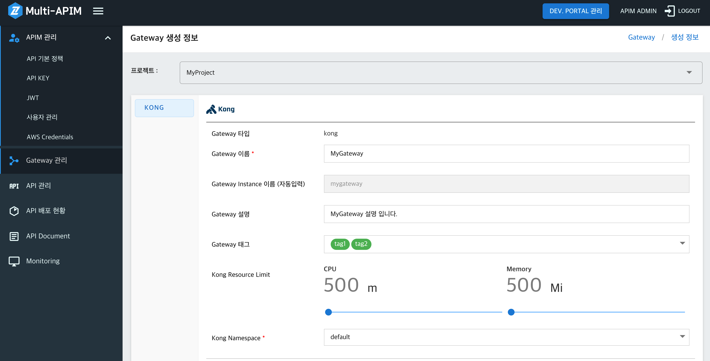
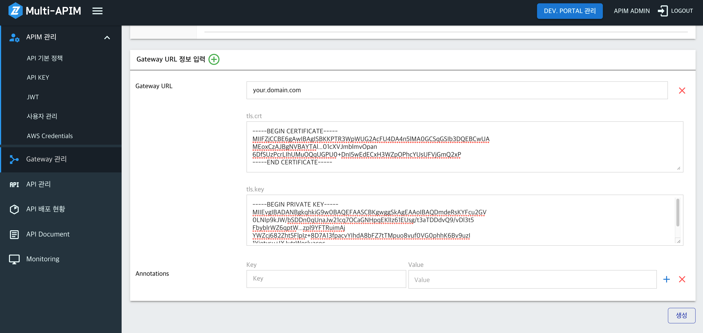
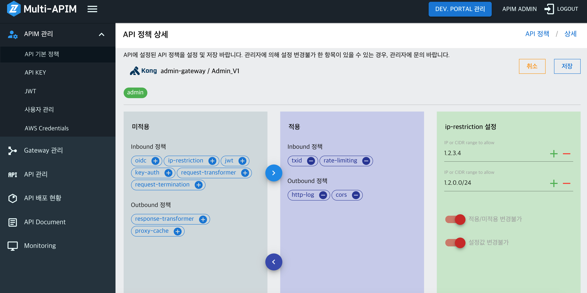

# (1) APIM 사용자 관리 (Tenant Manager Console) 가이드

- [권한 (Role)](<#권한-(Role)>)
- [사용자 관리](#사용자-관리)
  - [SSO 사용자 조회 및 사용자 추가](#SSO-사용자-조회-및-사용자-추가)
  - [사용자 관리](#사용자-관리)
  - [권한 수정](#권한-수정)
  - [사용자 삭제](#사용자-삭제)
- [프로젝트 관리](#프로젝트-관리)
  - [프로젝트 생성](#프로젝트-생성)
  - [프로젝트 사용자 관리](#프로젝트-사용자-관리)
  - [프로젝트 삭제](#프로젝트-삭제)

## 권한 (Role)

### 시스템 권한

| 권한                | 설명                                                                                                                                             |
| ------------------- | ------------------------------------------------------------------------------------------------------------------------------------------------ |
| apim-admin          | APIM 전체 관리자                                                                                                                                 |
| apim-member         | APIM 일반 사용자 권한 <br> Cloud Z CP의 사용자를 APIM으로 SSO사용자 가져오기 시 적용할 수 있는 기본 권한                                         |
| devportal-admin     | Developers Portal 전체 관리자                                                                                                                    |
| devportal-api-admin | Developers Portal Product 및 API 관리자 <br> Developers Portal 에 게시된 특정 Product-API의 관리, 설명 작성, Q&A, 결함 개선 등을 담당하는 권한   |
| devportal-member    | Developers Portal 일반 사용자 권한 <br> Developers Portal 에 사용자로 회원 가입 시 부여되는 기본 권한 <br> My Application 생성 및 멤버 초대 가능 |

### 프로젝트 권한

APIM에서 프로젝트는 2가지 type으로 표시 합니다.

- type: apim - APIM Console의 내부 API 개발용 조직/팀의 개념이고, APIM Console에서 "프로젝트(Project)"로 표시됨
- type: developers - Developers Portal의 일반 사용자가 개발하기 위한 "Application 또는 My Application"

| type       | 권한                                 | 설명                                                               |
| ---------- | ------------------------------------ | ------------------------------------------------------------------ |
| apim       | apim-pjt-admin                       | APIM 프로젝트 관리자<br>프로젝트 API 기본 정책, API KEY, 멤버 관리 |
| apim       | apim-pjt-member                      | APIM 프로젝트 멤버                                                 |
| developers | devportal-pjt-admin<br>(App. 관리자) | Developers Portal의 Application 관리자                             |
| developers | devportal-pjt-member                 | Developers Portal의 Application 멤버                               |

## 사용자 관리

### **SSO 사용자 조회 및 사용자 추가**

---

Apim은 ZCP SSO와 연동하여 사용자를 추가하며 사용자 권한을 따로 관리합니다.

1. Tenant-Manager 메뉴에서 사용자 관리를 클릭합니다.
   
2. SSO 사용자 가져오기 버튼을 눌러 SSO 사용자를 조회한 후 추가할 사용자를 선택합니다.
   
3. 추가할 사용자를 선택하고 가져오기 버튼을 누르면 대항 사용자에 대한 권한을 선택합니다.
   
4. 권한 선택 후 사용자 권한 설정 및 가져오기 버튼으로 사용자를 추가할 수 있습니다.
   

### **사용자 정보 수정**

---

1. 사용자 정보 관리를 위해 해당 사용자의 상세 버튼을 클릭합니다
   
2. 사용자의 정보를 수정 할 수 있습니다.
   

### **권한 수정**

---

1. 권한 수정을 위해 해당 사용자의 권한 변경 버튼을 클릭합니다.
   
2. 사용자의 권한을 수정 할 수 있습니다.
   

### **사용자 삭제**

---

1. 사용자 삭제를 위해 해당 사용자의 삭제 버튼을 클릭합니다
   
2. 사용자 정보 확인 후 삭제 버튼을 클릭하면 해당 사용자가 삭제됩니다.
   

## 프로젝트 관리

### **프로젝트 생성**

---

1. Tenant-Manager 메뉴에서 프로젝트 관리를 클릭합니다.
   
2. 각 항목을 입력합니다
    - 프로젝트 환경에 따라 Apim, Developer Portal 타입을 선택합니다.

### **프로젝트 사용자 관리**

---

1. 프로젝트 사용자 권한 관리를 위해 해당 프로젝트의 상세 버튼을 클릭합니다.
   
2. 프로젝트 사용자 관리 탭의 프로젝트 사용자 추가버튼을 클릭합니다.
   
3. 추가할 사용자를 조회하여 선택합니다.
   
4. 추가할 사용자의 권한을 선택 후 프로젝트 사용자 권한 설정 및 추가버튼을 클릭합니다.
   
5. 사용자가 추가되면 권한변경, 삭제가 가능합니다.
   

### **프로젝트 삭제**

---

1. 삭제할 프로젝트의 삭제 버튼을 클릭합니다.
   
2. 프로젝트 정보 확인 후 삭제 버튼을 클릭하면 해당 프로젝트가 삭제됩니다.
   

---

# (2) APIM Console 가이드

- [Gateway 관리](#gateway-관리)
- [API 관리](#api-관리)
- [API 배포 관리](#api-배포-관리)
- [API Document](#api-document)
- [Monitoring](#monitoring)

---

## Gateway 관리

### 1. Gateway 생성하기

- Gateway 생성 전 Project, Namespace 생성이 필요합니다.
- Project 생성 : `Menu > APIM 관리 > 사용자 관리`에서 프로젝트 생성이 가능합니다. [Tenant Manager Console 가이드](./TenantManager_Console.md#프로젝트-관리)
  - 1개 Project 당 1개의 Gateway를 생성할 수 있습니다.
  - 여러 개의 Project를 통해 여러 개의 Gateway를 통합 관리할 수 있습니다.
- Gateway 타입: [Kong API Gateway](https://docs.konghq.com/gateway-oss/)
- Gateway 이름: 필수항목 입니다. 영문, 숫자, 공백, '-', '\_', ':' 만 허용됩니다.
- Gateway 설명: Gateway의 설명을 입력할 수 있습니다.
- Gateway 태그: 태그 설정이 가능합니다. Gateway 록목록 화면에서 태그 기반으로 검색이 가능합니다. (사용법: 태그를 입력하고 Enter키를 누르세요.)
- Kong Namespace: Kong이 설치될 Namespace를 선택합니다.
- CPU/Memory를 설정 합니다.
- Replicas는 Gateway의 인스턴스 수 입니다. 2개로 설정할 경우, 앞서 설정한 CPU/Memory를 사용하는 인스턴스가 2개 기동 및 사용 됩니다.
- Gateway URL: Gateway로 들어가는 URL이고, 복수개 생성 가능 합니다. API생성 시 사용되므로 API 생성 전에 설정 되어야 합니다.
- tls.crt, tls.key: 입력 시 https 로 호출이 가능합니다. 미 입력 시 http로 호출 가능합니다.

<kbd></kbd>
<kbd></kbd>

### 2. Gateway 생성 후 화면

Gateway 목록 화면 (육각형 모향은 배포된 Kong Pod의 Replicas 수를 뜻합니다.)

<kbd></kbd>

### 3. Gateway 상세 화면

- CPU/Memory Replcas를 변경 할 수 있습니다.
- 설명, 태그, CPU/Memory, Replicas, Gateway URL 부분을 수정할 수 있습니다.
- Gateway에 설정된 태그는 API 목록 화면에서 검색 필터로 사용 가능 합니다.
- Gateway를 삭제할 수 있습니다. **주의!! Gateway를 삭제하면 Gateway에 속한 모든 데이터가 삭제됩니다.**

<kbd></kbd>

## API 관리

### 1. "API 생성 정보" 화면에서 API 생성하기

> API 생성 전, Gateway 생성이 필요합니다. [Gateway 관리](#gateway-관리)  
> API 생성 전, [API 기본정책 설정](./APIM_Console_Policy.md#API-기본정책-설정)이 필요합니다.

- API 이름: 필수항목 입니다. 영문, 숫자, 공백, '-', '\_', ':' 만 허용됩니다.
- API 설명: API 설명을 적을 수 있습니다.
- API 태그: 태그 설정이 가능합니다. API 목 화면에서 태그 기반으로 검색이 가능합니다. (사용법: 태그를 입력하고 Enter키를 누르세요.)
- API 타입: 통신 타입을 선택할 수 있습니다. (HTTP 통신, WebSocket 통신, AWS Lambda 함수 연동)
- Gateway: API를 생성하려는 Gateway를 선택할 수 있습니다.
- Gateway URL: Gateway에 속한 Gateway URL을 선택할 수 있습니다. API 호출 시 사용됩니다.
- Base Path: 해당 API 호출 시 사용되는 Path입니다. (예시: /Order)
- Gateway URL 및 Base Path 기반으로 API URL이 자동 완성 됩니다. API URL은 Client Appl.에서 호출해야할 API Endpoint 입니다.
- API 타입에 따른 상세 설정은 아래와 같습니다.
  - API 타입 - HTTP 통신, WebSocket 통신
    - Backend URL : Gateway에서 Proxy될 Backend Service의 주소 입니다.
    - Backend URL 입력 가능 형식은 다음과 같습니다.
      - http://domain.com/
      - http://domain.com
      - https://domain.com
      - http://sub3.sub2.sub1.domain.com
      - http://domain.com/path1
      - http://domain.com/path1/path2/path3
      - http://domain.com:8081
      - http://sub.domain.com:8081/path
  - API 타입 - AWS Lambda 함수 연동
    - AWS Lambda 함수 연동을 위해 `Menu > APIM 관리 > AWS Credentials` 화면 설정이 선행되어야 합니다.
    - Lambda Name: AWS Lambda 함수명 입니다.
    - AWS Region: AWS Lambda 함수의 Region 입니다.

```
API URL 호출 예시

- API TYPE : HTTP (https 프로토콜 사용)
- Gateway URL : your.domain.com
- Base Path : /myservice
- Backend URL : http://backend.com/backend

API 기본 정보가 위와 같은 경우 API URL은 다음과 같습니다.

- API URL : https://your.domain.com/myservice
```

> 예를 들어,  
> https://your.domain.com/myservice/v1/apis/ 를 호출하면
>
> 최종적으로  
> http://backend.com/backend/v1/apis/ 경로로 Proxy 됩니다.

- Developers Portal 게시: 체크 시 Developers Portal에서 해당 API가 조회되고, Developers Portal의 Product로 구성할 수 있게 됩니다. Product로 구성 관련 상세 설명은 [개발자포탈 가이드](./Developers_Portal.md)를 참고 바랍니다.

<kbd></kbd>

> ※ API 생성 시, "Swagger 가져오기 Path"를 통해 Swagger 문서 자동 가져오기 기능이 동작 합니다.  
> [Backend URL]/v2/api-docs의 경로로 Swagger JSON 조회 요청을 하고, Swagger JSON이 조회되는 경우, 가져와서 사용자에게 추가 여부를 확인 합니다.  
> API 생성 시점에 한 번 설정된 "Swagger 가져오기 Path"를 통해 가져오기 및 저장하기를 시도 합니다.  
> 한 번 가져오기 이후의 Swagger 편집은 API 상세화면에서 Swagger Editor를 통해 편집 가능 합니다.  
> "/v2/api-docs" 기본 Path는 서버 설정에 맞게 다른 Path로 Customizing 할 수 있습니다.

### 2. "API 생성 정보" 화면

<kbd></kbd>

#### 2-1. Frontend/Backend

- Frontend: API 호출 시 사용되는 API URL입니다.
- Backend: Frontend에서 API 호출 시 Proxy되는 Backend URL 입니다.

**수정** 버튼 클릭 시 API Frontend/Backend 수정 화면으로 이동합니다.

#### 2-2. API Policy 수정하기

**Policy 수정** 버튼 클릭 시 Policy 수정 화면으로 이동합니다.

- 미적용 영역에서 + 버튼을 누르면 중앙의 "적용" 영역으로 넘어갑니다.
- 적용 영역에서 - 버튼을 누르면 좌측의 "미적용" 영역으로 넘어갑니다.
- 각각의 policy 이름을 클릭하면 우측의 "설정" 영역에 config를 설정할 수 있는 화면이 나타납니다.
- policy 설정 후, [저장] 버튼으로 변경/설정 사항을 저장 합니다.
- 여러 Policy를 변경후 한번에 저장하지 않고, 하나의 policy 설정 후 저장을 해야 합니다.
- policy가 API에 반영되는 시점은, API 상세화면의 [배포] 버튼을 통한 배포 시, 반영 됩니다.
- `적용/미적용 변경불가` 스위치가 붉은색으로 ON 되어 있는 경우, 관리자 ( _apim-admin_ 권한자 ) 이외에는 적용/미적용을 변경할 수 없습니다.
- `설정값 변경불가` 스위치가 붉은색으로 ON 되어 있는 경우, 관리자 ( _apim-admin_ 권한자 ) 이외에는 Policy의 상세 설정값을 변경할 수 없습니다.
- `적용/미적용 변경불가` 및 `설정값 변경불가` 설정은 `APIM 관리 > API 기본 정책` 화면에서 관리자가 설정/변경 합니다.
- API Policy 별 상세 설명은 [API 정책 가이드](./APIM_Console_Policy.md)를 확인 바랍니다.

<kbd></kbd>

#### 2-3. API 문서 (Swagger)

- API 생성 시, `Swagger 가져오기 Path`를 설정하고, 이를 통해 가져온 경우에, Swagger 문서가 화면에 표시 됩니다.
- Swagger 문서를 수동으로도 입력 가능합니다.
- Backend URL에 Swagger문서가 존재한다면 /v2/api-docs 등의 Swagger JSON API를 이용하여 json 형식의 Swagger 문서를 가져올 수 있습니다.
- json 문서의 내용을 Swagger JSON Editor에 입력하면 Swagger UI로 변환되어 보여지고, [저장] 시 해당 Swagger가 저장 됩니다.
- Swagger된 Swagger는 API [배포] 시, 배포 버전과 함께 배포 되고, API Document(Left Menu)에서 최종 배포된 버전의 Swagger 문서가 공유 됩니다.
- `SWAGGER 가져오기` 버튼을 통해, API 생성/수정 시 설정한 `Swagger 가져오기 Path`를 호출하여 다시 가져오기를 수행하고, 가져온 내용을 화면에 표시 합니다.
- `SWAGGER 가져오기`로 가져온 내용은 `SWAGGER 저장`를 통해 저장 및 적용됨에 유의 바랍니다. `SWAGGER 저장`을 하지 않는다면 데이터저장소에는 기존 데이터를 유지합니다.
- 아직 API를 배포하지 않았기 때문에 현재 Swagger 문서의 기능으로 API Test를 수행할 수 없습니다.
- API 배포 후, Swagger 문서의 기능으로 API Test를 수행하는 것은, `Menu > API Document` 화면에서 배포된 상태의 최신 Swagger 문서를 통해 가능합니다.

API Swagger 적용 예시 화면입니다.

<kbd></kbd>

#### 2-4. API TEST 기능

- API 배포 전 테스트가 가능합니다.
- Method (GET, POST, PUT, DELETE, HEAD, OPTIONS, PATCH) 선택 가능하고, 특정 URL Path를 입력해 테스트할 수 있습니다. Template, Header, Query 입력도 가능합니다.
- Template: Path가 `/{key1}` 이고, Template이 { "key1" : "value1" } 이면 최종 Path는 `/value1` 로 자동 변환 됩니다.
- `테스트` 버튼을 통해 테스트 시, Response 영역에 테스트 결과가 표시 됩니다.

#### 2-5 배포 하기

- 충분한 테스트를 거친 후 API를 배포하여 외부로 노출시킬 수 있습니다.
- [배포하기] 버튼을 클릭하면 배포 버전에 대한 설명을 적어야 합니다. (필수입력)
- **배포는 여러번** 가능합니다. 배포할때마다 현재 시간을 버전명으로 배포가 됩니다. **단, 배포할때마다 최신버전만 외부로 노출됩니다.**(하나의 버전만 노출이 가능합니다.)
- 여기서 "외부로 노출"되는 것의 의미는, "[API URL]를 통해 실제로 Backend 서비스 호출이 가능하다"는 의미입니다.

## API 배포 관리

### 1. API 배포 현황 화면

- 프로젝트에 속한 배포된 API들을 보여줍니다.
- `Version`은 배포 시점의 시간 정보로 가장 최근에 배포된 배포버전이 표시 됩니다.
- `API 배포` 항목을 삭제하면 모든 버전 데이터가 함께 삭제 됩니다.

<kbd></kbd>

### 2. API 배포 상세 화면

- 기본적으로 배포된 최신 버전의 상태를 확인할 수 있습니다.
- `기존 버전 목록` 선택을 통하여, 버전별 배포 시점의 상세 설정을 확인할 수 있습니다.
- 하지만 이 화면에서는 Frontend, Backend, Policy, Swagger 문서를 수정할 수 없고, 수정은 "API 관리 > API 상세화면"에서 가능 합니다.
- `기존 버전 목록` 선택 및 `선택 버전 배포`를 통해, 과거에 배포한 버전으로 롤백(Rollback)이 가능합니다.

<kbd></kbd>

## API Document

- API Document 목록을 보여줍니다.
- `Menu > API 관리 > API 상세화면`에서 Swagger 문서를 입력하여 배포한 경우, 배포된 최신 버전의 Swagger 문서가 보여집니다.

<kbd></kbd>

- API Document 상세 화면에서는 아래의 이미지와 같이 Swagger UI를 보여줍니다.
- Swagger UI의 [Authorize] 버튼을 이용하여, API KEY를 설정한 API Test가 가능 합니다. ([API KEY 생성/관리](./APIM_Console_Policy.md#Key-Auth) 참고)
- API Test는 Swagger 문서의 세부 API 별 [Try it out] > [Execute] 버튼을 통해 가능 합니다.

<kbd></kbd>

## Monitoring

- Monitoring 메뉴 클릭 시 Grafana Dashboard 화면으로 이동합니다.
- Grafana Dashboard에는 Kong 리소스를 확인할 수 있는 전용 Dashboard가 존재합니다. (Dashboards --> General --> Kong)
- APIM Console에서 로그인하였으나, Grafana Dashboard에서 다시 로그인 화면이 나오는 경우, [Sign in with OAuth] 버튼을 클릭하여 로그인이 가능 합니다.

<kbd></kbd>

- service : Kong Gateway 내부에서 Backend 서비스
- route : Kong Gateway 내부에서 Frontend 서비스가 호출할 API Endpoint
- instance : Kong Gateway 인스턴스
- Total requests per second (RPS) : 초당 전체 요청수
- RPS per route/service (All) : API(route+service) 별 초당 요청수
- RPS fpr route/service by status code : status code 기준의 API(route+service) 별 초당 요청수
- Kong Proxy Latency ... : Kong Gateway Proxy 지연 시간
- Upstream Time ... : Backend Service 지연 시간
- Request Time ... : Kong Proxy Latency + Upstream Time
- Egress : OutBound 트래픽 양
- Ingress : InBound 트래픽 양
- Total Bandwidth : Ingress + Egress
- Caching : Kong Gateway 전체 Memory 대비 각 세부 캐시메모리의 사용률
- Nginx
  - reading : The current number of connections where nginx is reading the request header.
  - writing : The current number of connections where nginx is writing the response back to the client.
  - waiting : The current number of idle client connections waiting for a request.
  - Total Connections : The total number of client requests since the nginx master process started.
  - Handled Connections : This means nginx has finished writing data to the client. It has successfully finished and closed the request.
  - Accepted Connections : A connection moves to the Accepted state after the TCP handshake. It then takes one of three sub-states(waiting/reading/writing)

# (3) API 정책 가이드 (API Policy)

- [Policy](#Policy)
  - [Key Auth](#Key-Auth)
  - [Rate Limit](#Rate-Limit)
  - [Txid](#Txid)
  - [OIDC](#OIDC)
  - [Cors](#Cors)
  - [Proxy Cache](#Proxy-Cache)
  - [Request Transformer](#Request-Transformer)
  - [Response Transformer](#Response-Transformer)
  - [Http Log](#Http-Log)
- [API 정책 설정](#API-정책-설정)
- [API 기본정책 설정](#API-기본정책-설정)

---

## API 정책 설정

1. Api에 정책을 설정하기 위해 API 관리메뉴 > API 상세페이지로 이동합니다.
   <kbd></img></kbd>
2. Overview > Gateway 탭의 Policy 수정 버튼을 클릭합니다.
   <kbd></img></kbd>
3. 미적용 탭에서 적용할 정책의 Plus/Minus 버튼으로 적용/미적용 설정이 가능합니다.
   <kbd></img></kbd> - 각 정책에 대한 설명은 [Policy](#Policy) 참조
4. 적용된 정책을 클릭하여 상세 정보를 입력하고 저장버튼을 클릭합니다.
   <kbd></img></kbd>
5. API 상세 페이지에서 배포버튼을 클릭하여 Api를 배포하면 정책이 적용됩니다.
   <kbd></img></kbd>

---

## Policy

### Key Auth

---

Api에 Key인증을 추가합니다. API 호출 시 Header에 API 키를 추가하여 인증할 수 있습니다.

#### Apikey 생성

1. APIM 관리 -> API KEY 페이지로 이동하여 프로젝트를 선택합니다.
   <kbd></img></kbd>
2. API KEY 생성버튼을 클릭합니다.
   <kbd></img></kbd>
3. API Key의 간단한 설명을 적고 생성합니다.

- API Key는 임의의 값으로 자동생성 되며 생성된 API Key는 Project의 모든 Api가 공유합니다.

#### Key Auth 설정

1. Key Auth를 설정할 Api의 API 상세페이지로 이동하여 Policy 수정버튼을 클릭합니다.
   <kbd></img></kbd>
2. 미적용 탭에서 Key Auth의 Plus 버튼을 클릭하여 적용합니다.
   <kbd></img></kbd>
3. API 상세 페이지에서 배포버튼을 클릭하여 Api를 배포하면 정책이 적용됩니다.
   <kbd></img></kbd>

- API 호출 시 현재 프로젝트의 API KEY 로 인증 합니다. <br>
  만약 가능한 API KEY가 없는 경우, API를 정상 호출할 수 없음에 유의 바랍니다.<br>
  API KEY Header Name은 x-apim-key 입니다.

### Rate Limit

---

Rate Limit는 API 호출 시 초당 최대 요청수를 설정하며 최대요청수 이상으로는 API를 호출할 수 없습니다.

1. Rate Limit를 설정할 Api의 API 상세페이지로 이동하여 Policy 수정버튼을 클릭합니다.
   <kbd></img></kbd>
2. 미적용 탭에서 Rate Limit의 Plus 버튼을 클릭하여 적용합니다.
   <kbd></img></kbd>
3. 초당 최대요청수를 설정한 수 저장합니다.
4. API 상세 페이지에서 배포버튼을 클릭하여 Api를 배포하면 정책이 적용됩니다.
   <kbd></img></kbd>

### Txid

---

Txid는 API 호출 시 매 요청마다 HTTP Header에 Transaction ID가 자동 부여 됩니다.

1. Txid를 설정할 Api의 API 상세페이지로 이동하여 Policy 수정버튼을 클릭합니다.
   <kbd></img></kbd>
2. 미적용 탭에서 Txid의 Plus 버튼을 클릭하여 적용합니다.
   <kbd></img></kbd>
3. API 상세 페이지에서 배포버튼을 클릭하여 Api를 배포하면 정책이 적용됩니다.
   <kbd></img></kbd>

### OIDC

---

OIDC Provider와 연동하여 API 인증합니다.

1. OIDC 설정할 Api의 API 상세페이지로 이동하여 Policy 수정버튼을 클릭합니다.
   <kbd></img></kbd>
2. 미적용 탭에서 OIDC의 Plus 버튼을 클릭하여 적용합니다.
   <kbd></img></kbd>
   | 항목 | 설명 |
   |---|---|
   | Client ID | OIDC 클라이언트 ID |
   | Client Secret | OIDC 클라이언트 Secret |
   | Realm | OIDC 클라이언트 Realm |
   | Discovery | OIDC Provider의 Discovery Endpoint를 입력합니다 <br> ex) http://oidcprovider/openid-connect/.well-known/openid-configuration|
   | Introspection Endpoint | Token introspection endpoint를 입력합니다 <br> ex) http://oidcprovider/openid-connect/token/introspect|
   | Bearer Only | OIDC 리다이렉트 없이 토큰만 검사합니다.|
3. API 상세 페이지에서 배포버튼을 클릭하여 Api를 배포하면 정책이 적용됩니다.
   <kbd></img></kbd>

### Cors

---

Cors는 API 호출 시 Cors 설정을 추가합니다.

1. Cors를 설정할 Api의 API 상세페이지로 이동하여 Policy 수정버튼을 클릭합니다.
   <kbd></img></kbd>
2. 미적용 탭에서 Cors의 Plus 버튼을 클릭하여 적용합니다.
   <kbd></img></kbd>
   | 항목 | 설명 |
   |---|---|
   | methods | CORS 설정의 Access-Control-Allow-Methods Header |
   | origins | CORS 설정의 Access-Control-Allow-Origin Header|
3. API 상세 페이지에서 배포버튼을 클릭하여 Api를 배포하면 정책이 적용됩니다.
   <kbd></img></kbd>

### Proxy Cache

---

API 가 호출되면 응답코드, 콘텐츠 유형, 요청방법을 기반으로 응답을 캐싱합니다. 동일한 요청이 들어오면 메모리에 저장된 리소스를 가져오며 후속 요청에 대한 응답을 다시 캐싱합니다.
설정이 응답 헤더에 x-cache-key, x-cache-status 헤더가 추가되며 x-cache-status로 캐시 상태를 알 수 있습니다.  
| 캐시 상태 | 설명 |
|---|---|
| Miss | Caching된 데이터가 없는 상태 현재 응답을 Caching 합니다. |
| Hit | Caching된 데이터를 가져옴|
| Refresh | Caching 데이터를 가져왔지만 TTL이 만료된 경우|
| Bypass | Caching 할 수 없는 상태|

1. Proxy Cache를 설정할 Api의 API 상세페이지로 이동하여 Policy 수정버튼을 클릭합니다.
   <kbd></img></kbd>
2. 미적용 탭에서 Proxy Cache의 Plus 버튼을 클릭하여 적용합니다.
   <kbd></img></kbd>
   | 항목 | 설명 |
   |---|---|
   | TTL, in seconds, of cache entities | 캐싱된 데이터의 저장시간 해당시간이 지나면 캐싱된 데이터가 삭제됩니다.|
3. API 상세 페이지에서 배포버튼을 클릭하여 Api를 배포하면 정책이 적용됩니다.
   <kbd></img></kbd>

### Request Transformer

---

Request Transformer는 API 호출 시 Request Header, Body에 특정 데이터를 추가할 수 있습니다.

1. Request Transformer를 설정할 Api의 API 상세페이지로 이동하여 Policy 수정버튼을 클릭합니다.
   <kbd></img></kbd>
2. 미적용 탭에서 Request Transformer의 Plus 버튼을 클릭하여 적용합니다.
   <kbd></img></kbd> - 설정탭에서 데이터를 추가, 삭제 할 수 있습니다. - 작성 방식
   | 필드1 |필드2|필드3| 설명 |
   |---|---|---|---|
   | config | remove |headers<br>querystring<br>body|Request에 해당 header, queryString, body가 있으면 삭제합니다. 없으면 무시|
   | | rename |headers<br>querystring<br>body|Key : Value 형태로 입력합니다. <br>Request에 해당 header, queryString, body가 있으면 이름을 변경합니다. 없으면 무시|
   | | replace |headers<br>querystring<br>body<br>uri|Request에 해당 header, queryString, body가 있으면 데이터를 대체합니다. 없으면 무시<br>**uri**<br>해당 값으로 Api의 Path를 변경합니다.|
   | | add |headers<br>querystring<br>body|Key : Value 형태로 입력합니다. <br>Request에 해당 header, queryString, body가 없으면 새로운 데이터를 추가합니다.|
   | | append |headers<br>querystring<br>body|Key : Value 형태로 입력합니다. <br>Request에 해당 header, queryString, body에 새로운 데이터를 추가합니다. 중복 가능| - 예 config.add.headers=h1:v1,h2:v2, config.append.headers=h1:v1,h1:v2
3. API 상세 페이지에서 배포버튼을 클릭하여 Api를 배포하면 정책이 적용됩니다.
   <kbd></img></kbd>

### Response Transformer

---

Response Transformer는 API 호출 시 Response Header, Body에 특정 데이터를 추가할 수 있습니다.

1. Response Transformer를 설정할 Api의 API 상세페이지로 이동하여 Policy 수정버튼을 클릭합니다.
   <kbd></img></kbd>
2. 미적용 탭에서 Response Transformer의 Plus 버튼을 클릭하여 적용합니다.
   <kbd></img></kbd> - 설정탭에서 데이터를 추가, 삭제 할 수 있습니다. - 작성 방식
   | 필드1 |필드2|필드3| 설명 |
   |---|---|---|---|
   | config | remove |headers<br>json|Response에 해당 header, JSON body가 있으면 삭제합니다. 없으면 무시|
   | | rename |headers|**original_header_name : new_header_name** 형태로 입력합니다. <br>Response에 해당 header가 있으면 헤더 명을 변경합니다. 없으면 무시|
   | | replace |headers<br>json<br>json_types|**headers, json** <br> header/body명 : 값 형태로 입력합니다.<br> Response에 해당 header, body가 있으면 데이터를 대체합니다. 없으면 무시<br> **json_types**<br> body 명:type 형태로 입력합니다. <br>Response에서 대체할 body의 type를 입력합니다. (number, string)|
   | | add |headers<br>json<br>json_types|**headers, json** <br> header/body명 : 값 형태로 입력합니다.<br> Response에 해당 header, body가 있으면 데이터를 추가합니다. 없으면 무시<br> **json_types**<br> body 명:type 형태로 입력합니다. <br>Response에서 추가할 body의 type를 입력합니다. (number, string)|
   | | append |headers<br>json<br>json_types|**headers, json** <br> header/body명 : 값 형태로 입력합니다.<br> Response에 해당 header, body가 있으면 데이터를 추가 합니다. 없으면 무시<br> **json_types**<br> body 명:type 형태로 입력합니다. <br>Response에서 추가할 body의 type를 입력합니다. (number, string)| - 예 config.add.json=p1:v1,p2=v2, config.add.json_types=p1:string
3. API 상세 페이지에서 배포버튼을 클릭하여 Api를 배포하면 정책이 적용됩니다.
   <kbd></img></kbd>

### Http Log

---

Http Log는 API 호출 시 설정된 Http 서버로 요청, 응답 로그를 전송합니다.

1. Http Log를 설정할 Api의 API 상세페이지로 이동하여 Policy 수정버튼을 클릭합니다.
   <kbd></img></kbd>
2. 미적용 탭에서 Http Log의 Plus 버튼을 클릭하여 적용합니다.
   <kbd></img></kbd>
   | 항목 | 설명 |
   |---|---|
   | HTTP Endpoint for Sending Log | 로그를 전송할 Http 서버 Endpoint|
   | HTTP Method for HTTP Endpoint | Http 서버 Endpoint의 Method|
3. API 상세 페이지에서 배포버튼을 클릭하여 Api를 배포하면 정책이 적용됩니다.
   <kbd></img></kbd>

---

## API 기본정책 설정

신규 API가 생성될 때, 기본으로 적용될 공통 API 정책을 설정합니다.

1. APIM 관리 -> APIM 기본 정책 메뉴로 이동합니다.
   <kbd></img></kbd>
2. Plus/Minus 버튼으로 적용/미적용, 정책 클릭 시 세부 설정이 가능합니다.

---

# (4) 개발자 포탈 가이드 (Developers Portal)

- [로그인 하기](#로그인-하기)
- [Developers User 가이드](#developers-user-가이드)
  - [My Application 생성하기](#my-application-생성하기)
- [Developers Admin 가이드](#developers-admin-가이드)
  - [Home 화면 관리하기](#home-화면-관리하기)
  - [Menu 관리하기](#menu-관리하기)
  - [Product 관리하기](#product-관리하기)
  - [API 사용 요청 승인/반려](#api-사용-요청-승인/반려)

## 로그인 하기

로그인 종류는 사용자, 관리자로 나뉩니다.

아래 그림과 같이 두 가지 종류 중 하나를 선택하여 로그인 할 수 있습니다.

<kbd></kbd>

사용자 로그인 화면

<kbd></kbd>

관리자 로그인 화면 - Cloud ZCP Console 계정으로 로그인 할 수 있습니다.

<kbd></kbd>

## Developers User 가이드

### My Application 생성하기

Application -> My Applications -> 생성 버튼 클릭 -> Application 이름 작성

<kbd></kbd>

1. Application 기본 정보 화면

**Application 이름 수정, Application 아이콘 삽입, Application 삭제** 기능이 있습니다.

<kbd></kbd>
<br>

2. Application API KEY 화면

**보안을 위한 API KEY가 보여지는 화면 입니다. API KEY가 외부로 잘못 노출되었을때 API KEY를 재발급 하여 보안을 유지할 수 있습니다.**

<kbd></kbd>
<br>

3. API 사용 요청하기

**추가 버튼을 누르면 사용할 수 있는 API 항목이 나옵니다.**

<kbd></kbd>

관리자가 등록해 놓은 API 목록입니다. 선택 후 확인 버튼을 누르면 관리자에게 승인 요청이 보내집니다.

<kbd></kbd>

사용요청을 한 후 관리자가 승인할때까지 "대기" 상태로 나타납니다. 승인 후 "완료" 상태로 나타나며 이때부터 API URL이 보여지고 사용이 가능합니다.
<br>

4. 멤버 관리

**Application 에 멤버를 추가할 수 있습니다.**
<kbd></kbd>

## Developers Admin 가이드

### Home 화면 관리하기

Developers 포탈 Home 화면을 관리자가 직접 설정할 수 있습니다.

- 로고 이미지 삽입 가능
- Developers 포탈 Home 화면에 나타나는 슬라이드 이미지를 수정할 수 있습니다. 최대 5개 까지 가능하며 슬라이드 순서를 정할 수 있습니다.
- 슬라이드 시간을 설정할 수 있습니다. (1초~30초 사이로 설정 가능)
- Footer 설정: Footer 문구를 설정할 수 있습니다. 약관, 도움말 등의 링크 버튼을 설정할 수 있습니다.

<kbd></kbd>

---

### Menu 관리하기

Home 화면의 Menu를 관리자가 직접 관리할 수 있습니다.
<kbd></kbd>

메뉴 구조를 설정하고, 메뉴별 Contents를 작성할 수 있습니다.
<kbd></kbd>

위 화면에 편집 버튼을 누르면 아래와 같이 컨텐츠 작성 가능합니다.
<kbd></kbd>

---

### Product 관리하기

Developers 관리자 -> Product -> 생성 버튼 클릭 -> Product 이름 작성
<kbd></kbd>

1. Product 기본 정보 화면

**Product 이름 수정, 요약설명, 상세설명 URL, Product 아이콘 삽입** 기능이 있습니다.

> 요약설명: Developers 메인 화면의 상품 카드 UI에 요약 설명이 표시 됩니다.
>
> 상세설명 URL: Developers 메인 화면의 상품 카드 UI의 "제품 소개"를 클릭 시 이동할 화면 URL 입니다.

<kbd></kbd>

2. 담당자 지정 화면

**Product 및 Product API 관리 담당자를 추가 및 제거할 수 있습니다.**

> "추가" 버튼을 클릭하여 "Product" 및 "Product"의 API에 대한 상태 관리 및 사용자 질의/응답 담당자를 추가할 수 있습니다.
>
> "권한 관리" 버튼을 클릭하면 APIM Tenant Manager 화면으로 넘어가며, **devportal_admin** 또는 **devportal-api-admin** 권한이 부여된 사용자를 "Product" 담당자로 지정할 수 있습니다.

<kbd></kbd>

3. API 화면

**APIM Console에서 등록한 API를 Product에 추가할 수 있습니다.**

>  : API 정책을 확인할 수 있습니다.
>
>  : APIM Console 화면으로 이동합니다. APIM Console 화면에서 해당 API를 확인할 수 있습니다.

<kbd></kbd>

3-1. API 정책 설정

**Rate-limiting, request-transformer, response-transformer를 설정할 수 있습니다.**

> "Rate-limiting" : API 호출을 제한할 수 있습니다. 단위로는 second, minute, hour, day, month, year 이 있고, 최대호출수를 입력할 수 있습니다.
>
> "Request-transformer" : API 호출 시 Request, Reponse의 Header, Body 등의 데이터를 수정할 수 있습니다.
>
> | Operator | Kind        | 사용 방법                                                                                                                                                                                                                                                                                                                                                       | 예시                                |
> | -------- | ----------- | --------------------------------------------------------------------------------------------------------------------------------------------------------------------------------------------------------------------------------------------------------------------------------------------------------------------------------------------------------------- | ----------------------------------- |
> | Add      | Headers     | [추가하려는 header name]:[value] <br> 해당 헤더가 설정되어 있지 않은 경우에만 새 헤더가 추가됩니다. 같은 헤더가 이미 설정되어 있으면 무시됩니다.                                                                                                                                                                                                                | EX: x-new-header:new-value          |
> | Add      | Body        | [추가하려는 Body name]:[value] <br> content-type 이 [application/json, multipart/form-data, application/x-www-form-urlencoded] 중 하나이고 해당 body name이 없다면 form-encoded body 데이터로 추가 됩니다. 같은 body name이 존재한다면 무시 됩니다.                                                                                                             | EX: new-form-param:som_value        |
> | Add      | Querystring | [추가하려는 query name]:[value] <br> 해당 query string이 설정되어 있지 않은 경우 주어진 값으로 설정됩니다. 같은 query string이 이미 설정되어 있으면 무시됩니다.                                                                                                                                                                                                 | EX: new-param:some_value            |
> | Append   | Headers     | [추가하려는 header name]:[value] <br> 해당 헤더가 설정되어 있지 않은 경우 주어진 값으로 설정됩니다. 같은 헤더가 이미 설정되어 있으면 동일한 이름으로 새 값이 추가됩니다.                                                                                                                                                                                        | EX: x-new-header:new-value          |
> | Append   | Querystring | [추가하려는 query name]:[value] <br> 해당 query string이 설정되어 있지 않은 경우 주어진 값으로 설정됩니다. 같은 query string이 이미 설정되어 있으면 같은 이름으로 새 값이 추가됩니다.                                                                                                                                                                           | EX: new-param:some_value            |
> | Append   | Body        | [추가하려는 Body name]:[value] <br> content-type 이 [application/json, multipart/form-data, application/x-www-form-urlencoded] 중 하나이고 해당 body name이 없다면 form-encoded body 데이터로 추가 됩니다. 같은 body name이 존재하면 두 값은 배열 형식으로 집계됩니다. (기존 hello:world가 있고 hello:world2를 append하면 hello : [world,world2] 로 설정됩니다. | EX: new-form-param:som_value <br>   |
> | Rename   | Headers     | [기존 Header명]:[새로운 Header명] <br> 이미 존재하는 header 이름만 바꿀 수 있습니다. 존재하지 않는 header 이름 이면 무시됩니다.                                                                                                                                                                                                                                 | EX: header-old-name:header-new-name |
> | Rename   | Querystring | [기존 query string name ]:[새로운 query string name] <br> 이미 존재하는 query string 이름만 바꿀 수 있습니다. 존재하지 않는 query string 이름 이면 무시됩니다.                                                                                                                                                                                                  | EX: qs-old-name:qs-new-name         |
> | Rename   | Body        | [기존 body name]:[새로운 body name] <br> content-type 이 [application/json, multipart/form-data, application/x-www-form-urlencoded] 중 하나이고 매개변수가 있는 경우에만 적용 됩니다.                                                                                                                                                                           | EX: old-name:new-name               |
> | Replace  | Headers     | [header name]:[new value] <br> 헤더가 이미 설정된 경우에만 이전 값을 새 값으로 바꿉니다. 헤더가 설정되어 있지 않으면 무시됩니다.                                                                                                                                                                                                                                | EX: header-name:new-value           |
> | Replace  | Querystring | [query string name]:[new value] <br> query string이 이미 설정된 경우에만 이전 값을 새 값으로 바꿉니다. query string이 설정되어 있지 않으면 무시됩니다.                                                                                                                                                                                                          | EX: qs-name:new-value               |
> | Replace  | Body        | [body name]:[new value] <br> content-type 이 [application/json, multipart/form-data, application/x-www-form-urlencoded] 중 하나이고 매개변수가 있는 경우에만 새 값으로 바꿉니다. 해당 매개변수가 없으면 무시 됩니다.                                                                                                                                            | EX: body-name:new-value             |
> | Replace  | Uri         | <br> 주어진 값으로 업스트림 요청 URI를 업데이트 합니다. 이 값은 스키마 또는 호스트 이름이 아닌 URI의 경로 부분만 업데이트 합니다.                                                                                                                                                                                                                               | EX:                                 |
> | Remove   | Headers     | [header name] <br> 해당 header를 제거합니다.                                                                                                                                                                                                                                                                                                                    | EX: header-name                     |
> | Remove   | Querystring | [query string name] <br> 해당 query string을 제거합니다.                                                                                                                                                                                                                                                                                                        | EX: query-string-name               |
> | Remove   | body        | [body name] <br> 해당 파라미터를 제거합니다.                                                                                                                                                                                                                                                                                                                    | EX: body-name                       |
>
> "Response-transformer": API 호출 시 Response 데이터를 변경 가능합니다.
>
> | Operator | Kind       | 사용 방법                                                                                                                                                                | 예시                                           |
> | -------- | ---------- | ------------------------------------------------------------------------------------------------------------------------------------------------------------------------ | ---------------------------------------------- |
> | Add      | Headers    | [추가하려는 header name]:[value] <br> 해당 헤더가 설정되어 있지 않은 경우에만 새 헤더가 추가됩니다. 같은 헤더가 이미 설정되어 있으면 무시됩니다.                         | EX: x-new-header:new-value                     |
> | Add      | Json       | [json key]:[new value] <br> 추가하려는 parameter 기존에 없는 경우에만 Json Body에 추가됩니다. 속성이 이미 있는경우 무시 됩니다.                                          | EX: new-json-key:some_value                    |
> | Add      | Json_types | [json key]:[반환하려는 타입] <br> 새 JSON 속성을 추가 할 때 반환되는 JSON 값의 유형을 지정합니다.                                                                        | EX: new-json-key:string or new-json-key:number |
> | Append   | Headers    | [추가하려는 header name]:[value] <br> 해당 헤더가 설정되어 있지 않은 경우 주어진 값으로 설정됩니다. 같은 헤더가 이미 설정되어 있으면 동일한 이름으로 새 값이 추가됩니다. | EX: x-new-header:new-value                     |
> | Append   | Json       | [json key]:[new value] <br> 속성이 json body 본문에 없으면 지정된 값으로 추가 합니다. 이미 있는경우에는 이전 값과 새로운 값이 배열로 집계 됩니다.                        | EX: new-json-key:new-value                     |
> | Append   | Json_types | [json key]:[반환하려는 타입] <br> 새 JSON 속성을 추가 할 때 반환되는 JSON 값의 유형을 지정합니다.                                                                        | EX: new-json-key:string or new-json-key:number |
> | Rename   | Headers    | [기존 header name]:[새로운 header name] <br> 헤더가 이미 설정된 경우 이름을 새로운 헤더 이름으로 변경합니다. 헤더가 아직 설정되지 않은 경우 무시됩니다.                  | EX: old-header-name:new-header-name            |
> | Replace  | Headers    | [header name]:[new value] <br> 헤더가 이미 설정된 경우에만 이전 값을 새 값으로 바꿉니다. 헤더가 설정되어 있지 않으면 무시됩니다.                                         | EX: header-name:new-value                      |
> | Replace  | Json       | [json key]:[new value] <br> 매개 변수가 이미있는 경우에만 이전 값을 새 값으로 바꿉니다. 매개 변수가 아직 없으면 무시됩니다.                                              | EX: origin-json-key:new-value                  |
> | Replace  | Json_types | [json key]:[반환하려는 타입] <br> JSON 속성을 바꿀 때 반환되는 JSON 값의 유형을 지정합니다.                                                                              | EX: new-json-key:string or new-json-key:number |
> | Remove   | Headers    | [header name] <br> 해당 header를 제거합니다.                                                                                                                             | EX: header-name                                |
> | Remove   | Json       | [json key] <br> 해당 파라미터를 제거합니다.                                                                                                                              | EX: json-key                                   |

---

### API 사용 요청 승인/반려

Developers 사용자가 API 사용을 요청하면 관리자는 승인/반려가 가능합니다. 승인/반려 시 메시지 입력을 하여 사용자에게 승인/반려 메시지륿 보낼 수 있습니다.

어떤 Product의 어떤 API를 사용 요청했는지 볼 수 있습니다.
<kbd></kbd>
