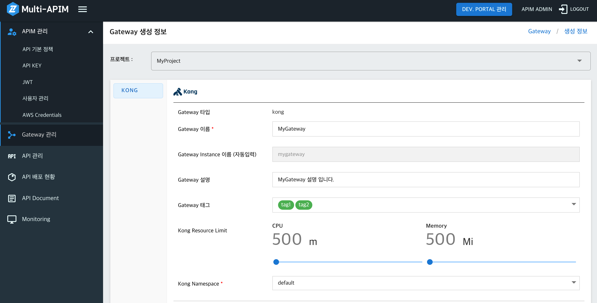
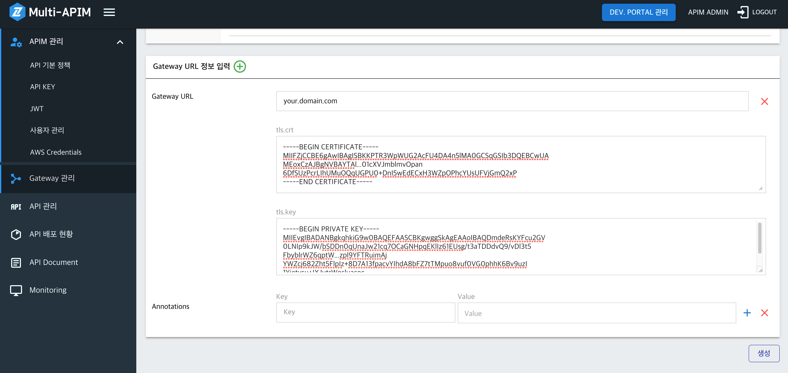
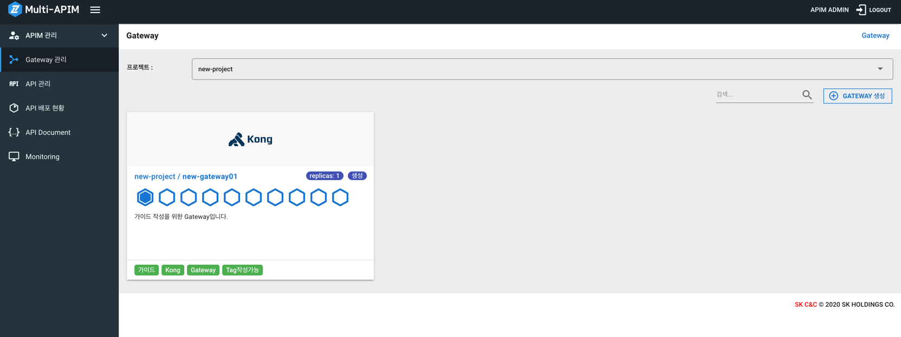
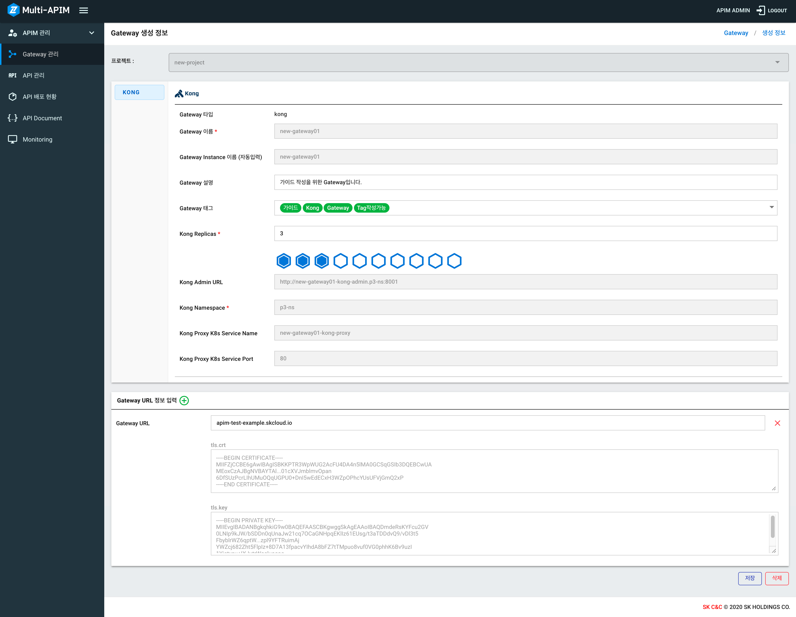
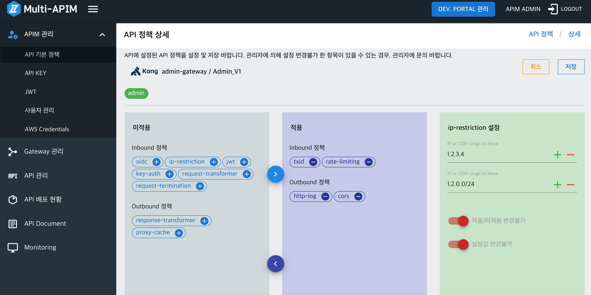
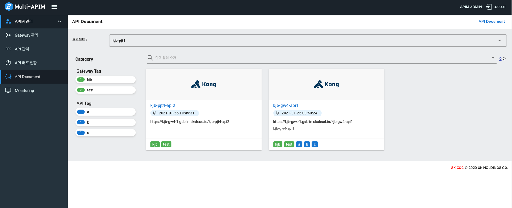

# APIM Console 가이드

- [Gateway 관리](#gateway-관리)
- [API 관리](#api-관리)
- [API 배포 관리](#api-배포-관리)
- [API Document](#api-document)
- [Monitoring](#monitoring)

---

## Gateway 관리

### 1. Gateway 생성하기

- Gateway 생성 전 Project, Namespace 생성이 필요합니다.
- Project 생성 : `Menu > APIM 관리 > 사용자 관리`에서 프로젝트 생성이 가능합니다. [Tenant Manager Console 가이드](./TenantManager_Console.md#프로젝트-관리)
  - 1개 Project 당 1개의 Gateway를 생성할 수 있습니다.
  - 여러 개의 Project를 통해 여러 개의 Gateway를 통합 관리할 수 있습니다.
- Gateway 타입: [Kong API Gateway](https://docs.konghq.com/gateway-oss/)
- Gateway 이름: 필수항목 입니다. 영문, 숫자, 공백, '-', '\_', ':' 만 허용됩니다.
- Gateway 설명: Gateway의 설명을 입력할 수 있습니다.
- Gateway 태그: 태그 설정이 가능합니다. Gateway 록목록 화면에서 태그 기반으로 검색이 가능합니다. (사용법: 태그를 입력하고 Enter키를 누르세요.)
- Kong Namespace: Kong이 설치될 Namespace를 선택합니다.
- CPU/Memory를 설정 합니다.
- Replicas는 Gateway의 인스턴스 수 입니다. 2개로 설정할 경우, 앞서 설정한 CPU/Memory를 사용하는 인스턴스가 2개 기동 및 사용 됩니다.
- Gateway URL: Gateway로 들어가는 URL이고, 복수개 생성 가능 합니다. API생성 시 사용되므로 API 생성 전에 설정 되어야 합니다.
- tls.crt, tls.key: 입력 시 https 로 호출이 가능합니다. 미 입력 시 http로 호출 가능합니다.

<kbd></kbd>
<kbd></kbd>

### 2. Gateway 생성 후 화면

Gateway 목록 화면 (육각형 모향은 배포된 Kong Pod의 Replicas 수를 뜻합니다.)

<kbd></kbd>

### 3. Gateway 상세 화면

- CPU/Memory Replcas를 변경 할 수 있습니다.
- 설명, 태그, CPU/Memory, Replicas, Gateway URL 부분을 수정할 수 있습니다.
- Gateway에 설정된 태그는 API 목록 화면에서 검색 필터로 사용 가능 합니다.
- Gateway를 삭제할 수 있습니다. **주의!! Gateway를 삭제하면 Gateway에 속한 모든 데이터가 삭제됩니다.**

<kbd></kbd>

## API 관리

### 1. "API 생성 정보" 화면에서 API 생성하기

> API 생성 전, Gateway 생성이 필요합니다. [Gateway 관리](#gateway-관리)  
> API 생성 전, [API 기본정책 설정](./APIM_Console_Policy.md#API-기본정책-설정)이 필요합니다.

- API 이름: 필수항목 입니다. 영문, 숫자, 공백, '-', '\_', ':' 만 허용됩니다.
- API 설명: API 설명을 적을 수 있습니다.
- API 태그: 태그 설정이 가능합니다. API 목 화면에서 태그 기반으로 검색이 가능합니다. (사용법: 태그를 입력하고 Enter키를 누르세요.)
- API 타입: 통신 타입을 선택할 수 있습니다. (HTTP 통신, WebSocket 통신, AWS Lambda 함수 연동)
- Gateway: API를 생성하려는 Gateway를 선택할 수 있습니다.
- Gateway URL: Gateway에 속한 Gateway URL을 선택할 수 있습니다. API 호출 시 사용됩니다.
- Base Path: 해당 API 호출 시 사용되는 Path입니다. (예시: /Order)
- Gateway URL 및 Base Path 기반으로 API URL이 자동 완성 됩니다. API URL은 Client Appl.에서 호출해야할 API Endpoint 입니다.
- API 타입에 따른 상세 설정은 아래와 같습니다.
  - API 타입 - HTTP 통신, WebSocket 통신
    - Backend URL : Gateway에서 Proxy될 Backend Service의 주소 입니다.
    - Backend URL 입력 가능 형식은 다음과 같습니다.
      - http://domain.com/
      - http://domain.com
      - https://domain.com
      - http://sub3.sub2.sub1.domain.com
      - http://domain.com/path1
      - http://domain.com/path1/path2/path3
      - http://domain.com:8081
      - http://sub.domain.com:8081/path
  - API 타입 - AWS Lambda 함수 연동
    - AWS Lambda 함수 연동을 위해 `Menu > APIM 관리 > AWS Credentials` 화면 설정이 선행되어야 합니다.
    - Lambda Name: AWS Lambda 함수명 입니다.
    - AWS Region: AWS Lambda 함수의 Region 입니다.

```
API URL 호출 예시

- API TYPE : HTTP (https 프로토콜 사용)
- Gateway URL : your.domain.com
- Base Path : /myservice
- Backend URL : http://backend.com/backend

API 기본 정보가 위와 같은 경우 API URL은 다음과 같습니다.

- API URL : https://your.domain.com/myservice
```

> 예를 들어,  
> https://your.domain.com/myservice`/v1/apis/` 를 호출하면  
> 최종적으로  
> http://backend.com/backend`/v1/apis/` 경로로 Proxy 됩니다.

- Developers Portal 게시: 체크 시 Developers Portal에서 해당 API가 조회되고, Developers Portal의 Product로 구성할 수 있게 됩니다. Product로 구성 관련 상세 설명은 [개발자포탈 가이드](./Developers_Portal.md)를 참고 바랍니다.

<kbd></kbd>

> ※ API 생성 시, "Swagger 가져오기 Path"를 통해 Swagger 문서 자동 가져오기 기능이 동작 합니다.  
> [Backend URL]/v2/api-docs의 경로로 Swagger JSON 조회 요청을 하고, Swagger JSON이 조회되는 경우, 가져와서 사용자에게 추가 여부를 확인 합니다.  
> API 생성 시점에 한 번 설정된 "Swagger 가져오기 Path"를 통해 가져오기 및 저장하기를 시도 합니다.  
> 한 번 가져오기 이후의 Swagger 편집은 API 상세화면에서 Swagger Editor를 통해 편집 가능 합니다.  
> "/v2/api-docs" 기본 Path는 서버 설정에 맞게 다른 Path로 Customizing 할 수 있습니다.

### 2. "API 생성 정보" 화면

<kbd></kbd>

#### 2-1. Frontend/Backend

- Frontend: API 호출 시 사용되는 API URL입니다.
- Backend: Frontend에서 API 호출 시 Proxy되는 Backend URL 입니다.

**수정** 버튼 클릭 시 API Frontend/Backend 수정 화면으로 이동합니다.

#### 2-2. API Policy 수정하기

**Policy 수정** 버튼 클릭 시 Policy 수정 화면으로 이동합니다.

- 미적용 영역에서 + 버튼을 누르면 중앙의 "적용" 영역으로 넘어갑니다.
- 적용 영역에서 - 버튼을 누르면 좌측의 "미적용" 영역으로 넘어갑니다.
- 각각의 policy 이름을 클릭하면 우측의 "설정" 영역에 config를 설정할 수 있는 화면이 나타납니다.
- policy 설정 후, [저장] 버튼으로 변경/설정 사항을 저장 합니다.
- 여러 Policy를 변경후 한번에 저장하지 않고, 하나의 policy 설정 후 저장을 해야 합니다.
- policy가 API에 반영되는 시점은, API 상세화면의 [배포] 버튼을 통한 배포 시, 반영 됩니다.
- `적용/미적용 변경불가` 스위치가 붉은색으로 ON 되어 있는 경우, 관리자 ( _apim-admin_ 권한자 ) 이외에는 적용/미적용을 변경할 수 없습니다.
- `설정값 변경불가` 스위치가 붉은색으로 ON 되어 있는 경우, 관리자 ( _apim-admin_ 권한자 ) 이외에는 Policy의 상세 설정값을 변경할 수 없습니다.
- `적용/미적용 변경불가` 및 `설정값 변경불가` 설정은 `APIM 관리 > API 기본 정책` 화면에서 관리자가 설정/변경 합니다.
- API Policy 별 상세 설명은 [API 정책 가이드](./APIM_Console_Policy.md)를 확인 바랍니다.

<kbd></kbd>

#### 2-3. API 문서 (Swagger)

- API 생성 시, `Swagger 가져오기 Path`를 설정하고, 이를 통해 가져온 경우에, Swagger 문서가 화면에 표시 됩니다.
- Swagger 문서를 수동으로도 입력 가능합니다.
- Backend URL에 Swagger문서가 존재한다면 /v2/api-docs 등의 Swagger JSON API를 이용하여 json 형식의 Swagger 문서를 가져올 수 있습니다.
- json 문서의 내용을 Swagger JSON Editor에 입력하면 Swagger UI로 변환되어 보여지고, [저장] 시 해당 Swagger가 저장 됩니다.
- Swagger된 Swagger는 API [배포] 시, 배포 버전과 함께 배포 되고, API Document(Left Menu)에서 최종 배포된 버전의 Swagger 문서가 공유 됩니다.
- `SWAGGER 가져오기` 버튼을 통해, API 생성/수정 시 설정한 `Swagger 가져오기 Path`를 호출하여 다시 가져오기를 수행하고, 가져온 내용을 화면에 표시 합니다.
- `SWAGGER 가져오기`로 가져온 내용은 `SWAGGER 저장`를 통해 저장 및 적용됨에 유의 바랍니다. `SWAGGER 저장`을 하지 않는다면 데이터저장소에는 기존 데이터를 유지합니다.
- 아직 API를 배포하지 않았기 때문에 현재 Swagger 문서의 기능으로 API Test를 수행할 수 없습니다.
- API 배포 후, Swagger 문서의 기능으로 API Test를 수행하는 것은, `Menu > API Document` 화면에서 배포된 상태의 최신 Swagger 문서를 통해 가능합니다.

API Swagger 적용 예시 화면입니다.

<kbd></kbd>

#### 2-4. API TEST 기능

- API 배포 전 테스트가 가능합니다.
- Method (GET, POST, PUT, DELETE, HEAD, OPTIONS, PATCH) 선택 가능하고, 특정 URL Path를 입력해 테스트할 수 있습니다. Template, Header, Query 입력도 가능합니다.
- Template: Path가 `/{key1}` 이고, Template이 { "key1" : "value1" } 이면 최종 Path는 `/value1` 로 자동 변환 됩니다.
- `테스트` 버튼을 통해 테스트 시, Response 영역에 테스트 결과가 표시 됩니다.

#### 2-5 배포 하기

- 충분한 테스트를 거친 후 API를 배포하여 외부로 노출시킬 수 있습니다.
- [배포하기] 버튼을 클릭하면 배포 버전에 대한 설명을 적어야 합니다. (필수입력)
- **배포는 여러번** 가능합니다. 배포할때마다 현재 시간을 버전명으로 배포가 됩니다. **단, 배포할때마다 최신버전만 외부로 노출됩니다.**(하나의 버전만 노출이 가능합니다.)
- 여기서 "외부로 노출"되는 것의 의미는, "[API URL]를 통해 실제로 Backend 서비스 호출이 가능하다"는 의미입니다.

## API 배포 관리

### 1. API 배포 현황 화면

- 프로젝트에 속한 배포된 API들을 보여줍니다.
- `Version`은 배포 시점의 시간 정보로 가장 최근에 배포된 배포버전이 표시 됩니다.
- `API 배포` 항목을 삭제하면 모든 버전 데이터가 함께 삭제 됩니다.

<kbd></kbd>

### 2. API 배포 상세 화면

- 기본적으로 배포된 최신 버전의 상태를 확인할 수 있습니다.
- `기존 버전 목록` 선택을 통하여, 버전별 배포 시점의 상세 설정을 확인할 수 있습니다.
- 하지만 이 화면에서는 Frontend, Backend, Policy, Swagger 문서를 수정할 수 없고, 수정은 "API 관리 > API 상세화면"에서 가능 합니다.
- `기존 버전 목록` 선택 및 `선택 버전 배포`를 통해, 과거에 배포한 버전으로 롤백(Rollback)이 가능합니다.

<kbd></kbd>

## API Document

- API Document 목록을 보여줍니다.
- `Menu > API 관리 > API 상세화면`에서 Swagger 문서를 입력하여 배포한 경우, 배포된 최신 버전의 Swagger 문서가 보여집니다.

<kbd></kbd>

- API Document 상세 화면에서는 아래의 이미지와 같이 Swagger UI를 보여줍니다.
- Swagger UI의 [Authorize] 버튼을 이용하여, API KEY를 설정한 API Test가 가능 합니다. ([API KEY 생성/관리](./APIM_Console_Policy.md#Key-Auth) 참고)
- API Test는 Swagger 문서의 세부 API 별 [Try it out] > [Execute] 버튼을 통해 가능 합니다.

<kbd></kbd>

## Monitoring

- Monitoring 메뉴 클릭 시 Grafana Dashboard 화면으로 이동합니다.
- Grafana Dashboard에는 Kong 리소스를 확인할 수 있는 전용 Dashboard가 존재합니다. (Dashboards --> General --> Kong)
- APIM Console에서 로그인하였으나, Grafana Dashboard에서 다시 로그인 화면이 나오는 경우, [Sign in with OAuth] 버튼을 클릭하여 로그인이 가능 합니다.

<kbd></kbd>

- service : Kong Gateway 내부에서 Backend 서비스
- route : Kong Gateway 내부에서 Frontend 서비스가 호출할 API Endpoint
- instance : Kong Gateway 인스턴스
- Total requests per second (RPS) : 초당 전체 요청수
- RPS per route/service (All) : API(route+service) 별 초당 요청수
- RPS fpr route/service by status code : status code 기준의 API(route+service) 별 초당 요청수
- Kong Proxy Latency ... : Kong Gateway Proxy 지연 시간
- Upstream Time ... : Backend Service 지연 시간
- Request Time ... : Kong Proxy Latency + Upstream Time
- Egress : OutBound 트래픽 양
- Ingress : InBound 트래픽 양
- Total Bandwidth : Ingress + Egress
- Caching : Kong Gateway 전체 Memory 대비 각 세부 캐시메모리의 사용률
- Nginx
  - reading : The current number of connections where nginx is reading the request header.
  - writing : The current number of connections where nginx is writing the response back to the client.
  - waiting : The current number of idle client connections waiting for a request.
  - Total Connections : The total number of client requests since the nginx master process started.
  - Handled Connections : This means nginx has finished writing data to the client. It has successfully finished and closed the request.
  - Accepted Connections : A connection moves to the Accepted state after the TCP handshake. It then takes one of three sub-states(waiting/reading/writing)
