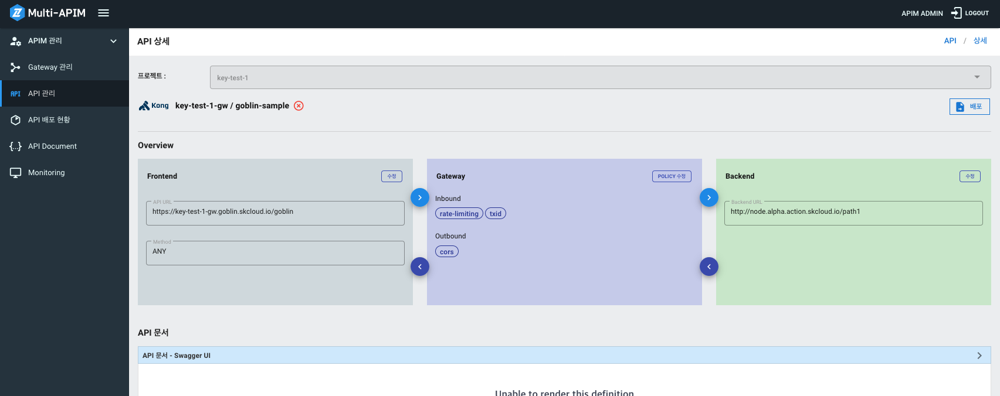
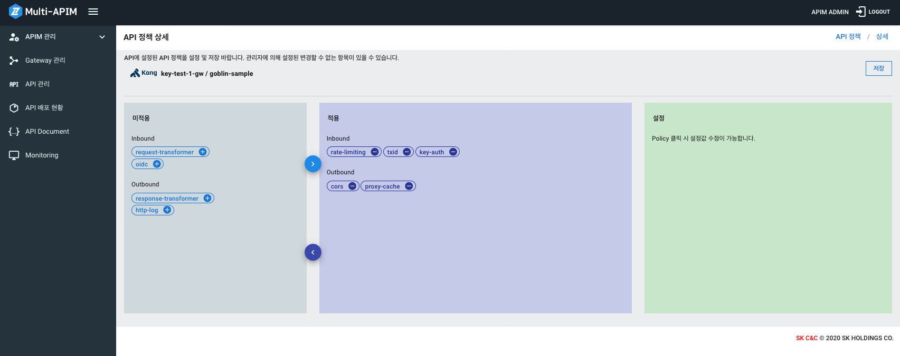
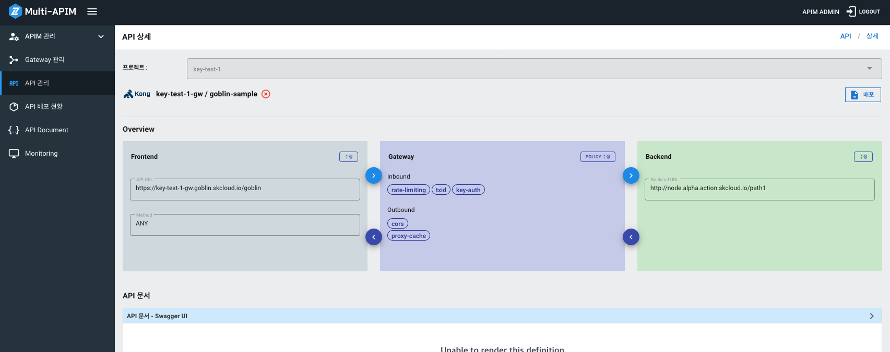

# Api Policy

- [Policy](#Policy)
    - [Key Auth](#Key-Auth)
    - [Rate Limit](#Rate-Limit)
    - [Txid](#Txid)
    - [OIDC](#OIDC)
    - [Cors](#Cors)
    - [Proxy Cache](#Proxy-Cache)
    - [Request Transformer](#Request-Transformer)
    - [Response Transformer](#Response-Transformer)
    - [Http Log](#Http-Log)
- [Api 정책 설정](#Api-정책-설정)
- [Api 기본정책 설정](#Api-기본정책-설정)
---
## Policy
### Key Auth
### Rate Limit
### Txid
### OIDC
### Cors
### Proxy Cache
### Request Transformer
### Response Transformer
### Http Log
---
## Api 정책 설정
1. Api에 정책을 설정하기 위해 Api 관리메뉴 > Api 상세페이지로 이동합니다.

2. Overview > Gateway 탭의 Policy 수정 버튼을 클릭합니다.

3. 미적용 탭에서 적용할 정책의 Plus/Minus 버튼으로 적용/미적용 설정이 가능합니다.

4. 적용된 정책을 클릭하여 상세 정보를 입력하고 저장버튼을 클릭합니다.

5. Api 상세 페이지에서 배포버튼을 클릭하여 Api를 배포하면 정책이 적용됩니다.

---
## Api 기본정책 설정
신규 API가 생성될 때, 기본으로 적용될 공통 API 정책을 설정합니다. 
1. APIM 관리 -> APIM 기본 정책 메뉴로 이동합니다.

2. Plus/Minus 버튼으로 적용/미적용, 정책 클릭 시 세부 설정이 가능합니다. 
