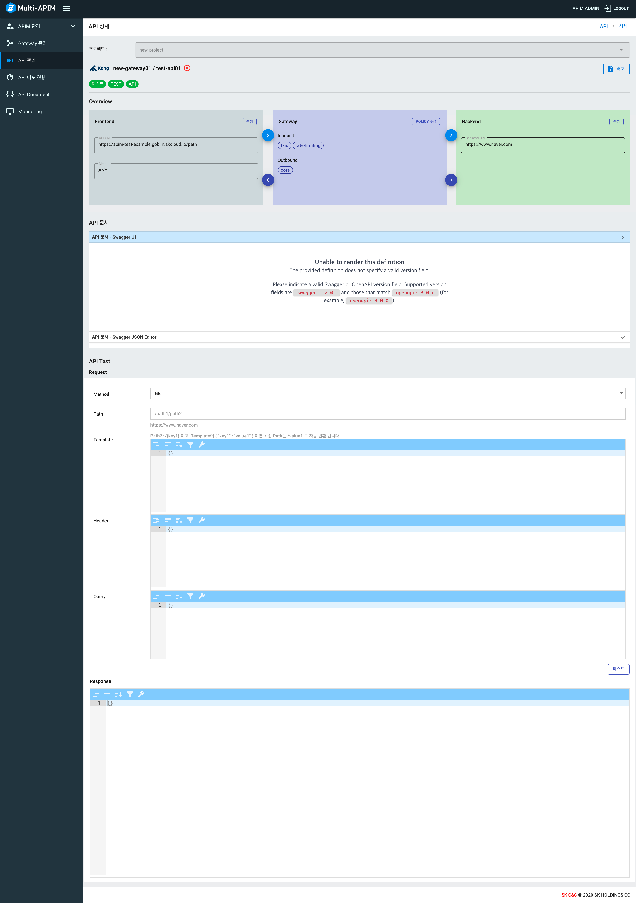
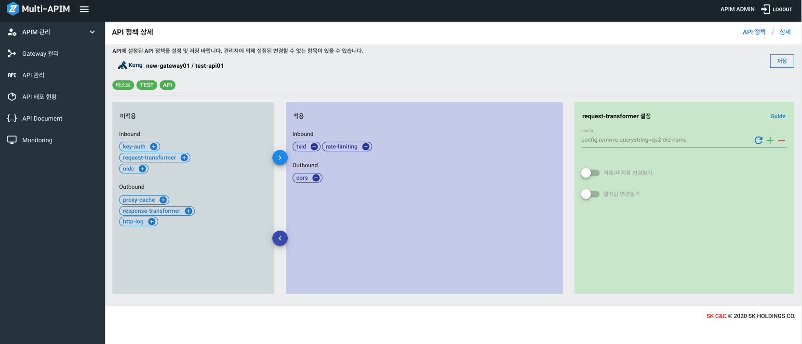

# APIM Console 가이드

- [Gateway 관리](#gateway-관리)
- [API 관리](#api-관리)
    - [My Application 생성하기](#my-application-생성하기)
- [Developers Admin 가이드](#developers-admin-가이드)
    - [Home 화면 관리하기](#home-화면-관리하기)
    - [Menu 관리하기](#menu-관리하기)
    - [Product 관리하기](#product-관리하기)
    - [API 사용 요청 승인/반려](#api-사용-요청-승인/반려)

---
## Gateway 관리

1. Gateway 생성하기(Kong)
> Gateway 생성 전 Project, Namespace 생성이 필요합니다.   
> - Project 생성 : APIM 관리 - 사용자 관리(Tenant Manaer Console) 에서 프로젝트 생성이 가능합니다. [여기](../tenant-manager/Tenant-manager.md#프로젝트-관리) 를 클릭하여 Tenant Manager 가이드로 이동합니다.  
> - Kong이 설치될 Namespace 생성: ZCP console - Administration - Namespaces 메뉴에서 Kubernetes Namespace 생성이 가능합니다.

- Gateway 타임: kong (AWS 추후 제공)
- Gateway 이름: 필수항목 입니다. 영문, 숫자, 공백, '-', '_', ':' 만 허용됩니다.
- Gateway 설명: Gateway의 설명을 적을 수 있습니다.
- Gateway 태그: 태그 설정이 가능합니다. Gateway 록목록 화면에서 태그 기반으로 검색이 가능합니다. (사용법: 태그를 입력하고 Enter키를 누르세요.)
- Kong Namespace: Kong이 설치될 Namespace를 선택합니다. 
- Gateway URL: Gateway로 들어가는 URL 입니다. API생성 시 사용됩니다.
- tls.crt, tls.key: 입력 시 https 로 호출이 가능합니다. 미 입력 시 http로 호출 가능합니다.

<kbd></kbd>

2. Gateway 생성 후 화면

Gateway 목록 화면 (육각형 모향은 배포된 Kong Pod의 replicas 수를 뜻합니다.) 

<kbd></kbd>

Gateway 상세 화면
- Kong Replcas 수를 설정 할 수 있습니다.
- 설명, 태크, replicas, Gateway URL 부분을 수정할 수 있습니다.
- Gateway를 삭제할 수 있습니다. **주의!! Gateway를 삭제하면 Gateway에 속한 모든 데이터가 삭제됩니다.**

<kbd></kbd>

## API 관리

1. API 생성하기
> API 생성 전 Gateway 생성이 필요합니다. [여기](#gateway-관리) 를 클릭하여 Gateway 생성 가이드로 이동합니다.

- API 이름: 필수항목 입니다. 영문, 숫자, 공백, '-', '_', ':' 만 허용됩니다.
- API 설명: API 설명을 적을 수 있습니다.
- API 태그: 태그 설정이 가능합니다. API 목 화면에서 태그 기반으로 검색이 가능합니다. (사용법: 태그를 입력하고 Enter키를 누르세요.)
- API 타입: 통신 타입을 선택할 수 있습니다. (HTTP or Socket)
- Gateway: API를 생성하려는 Gateway를 선택할 수 있습니다.
- Gateway URL: Gateway에 속한 Gateway URL을 선택할 수 있습니다. API 호출 시 사용됩니다.
- Base Path: 해당 API 호출 시 사용되는 Path입니다. https://<GatewayURL>/<BasePath>
- Backend URL: API 호출 시 맵핑되는 Upstream URL 입니다. https://<GatewayURL>/<BasePath> --> https://<BackendURL> 
- Developers Portal 게시: 체크 시 Developers Portal에 해당 API가 노출됩니다. [여기](../developers/README.md) 를 클릭하면 Developers Portal 가이드로 이동합니다.

<kbd></kbd>

2. API 상세화면

<kbd></kbd>

2-1. Frontend - Backend

>Frontend: API 호출 시 사용되는 API URL입니다.
> 
>Backend: Frontend 이랑 맵핑된 Upstream URL 입니다. 

**수정** 버튼 클릭 시 API 수정 화면으로 이동합니다.

2-2. Gateway Policy 수정하기

**Policy 수정** 버튼 클릭 시 Policy 수정 화면으로 이동합니다.

- 미적용 영역에서 + 버튼을 누르면 적용 영역으로 넘어갑니다.
- 적용 영역에서 - 버튼을 누르면 미적용 영역으로 넘어갑니다.
- 각각의 policy 이름을 클릭하면 설정 영역에 config를 설정할 수 있는 화면이 나타납니다. 

<kbd></kbd>

2-3. API 문서 (Swagger)

- Swagger 문서를 수동으로 입력 가능합니다.
- Backend URL에 Swagger문서가 존재한다면 /v2/api-docs 경로에서 json 형식의 Swagger 문서를 받을 수 있습니다. 이 문서를  Swagger JSON Editor에 넣으면 Swagger UI가 보여집니다.

API Swagger 적용 예시 화면입니다.

<kbd></kbd>

2-4. API TEST 기능

