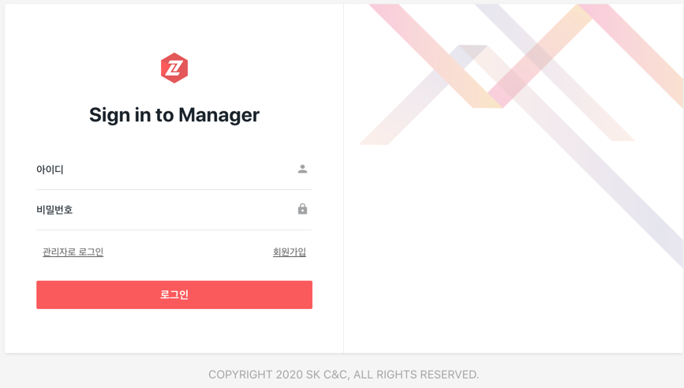
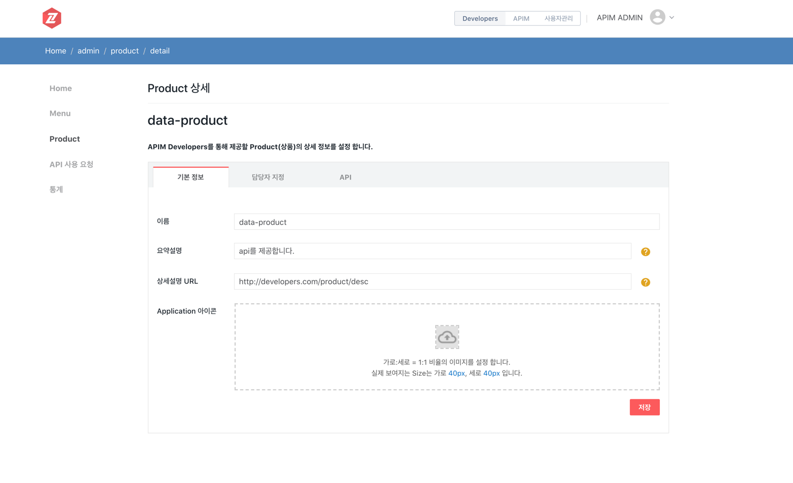
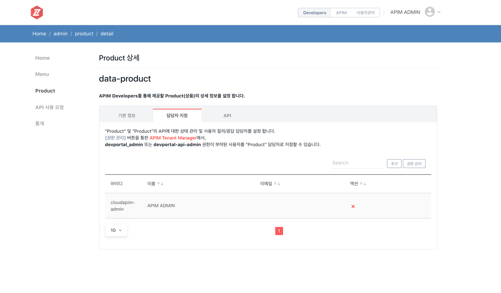
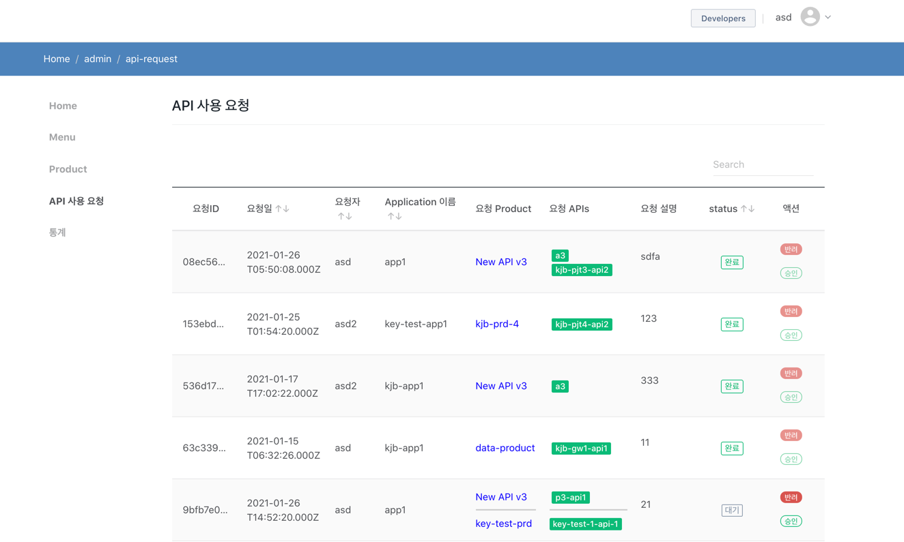

# Developers Portal

- [로그인 하기](#로그인-하기)
- [Developers User 가이드](#developers-user-가이드)
    - [My Application 생성하기](#my-application-생성하기)
    - [소 목차2](#)
- [Developers Admin 화면](#developers-admin-가이드)

## 로그인 하기
로그인 종류는 사용자, 관리자로 나뉩니다.

아래 그림과 같이 두 가지 종류 중 하나를 선택하여 로그인 할 수 있습니다.

사용자 로그인 화면

관리자 로그인 화면 - Cloud ZCP Console 계정으로 로그인 할 수 있습니다.

## Developers User 가이드

### My Application 생성하기

Application -> My Applications -> 생성 버튼 클릭 -> Application 이름 작성

1. Application 기본 정보 화면

**Application 이름 수정, Application 아이콘 삽입, Application 삭제** 기능이 있습니다.

2. Application API KEY 화면

**보안을 위한 API KEY가 보여지는 화면 입니다. API KEY가 외부로 잘못 노출되었을때 API KEY를 재발급 하여 보안을 유지할 수 있습니다.**

3. API 사용 요청하기

**추가 버튼을 누르면 사용할 수 있는 API 항목이 나옵니다.**

**관리자가 등록해 놓은 API 목록입니. 선택 후 확인 버튼을 누르면 관리자에게 승인 요청다이 보내집니다.**

사용요청을 한 후 관리자가 승인할때까지 "대기" 상태로 나타납니다. 승인 후 "완료" 상태로 나타나며 이때부터 API URL이 보여지고 사용이 가능합니다. 

4. 멤버 관리

**Application 에 멤버를 추가할 수 있습니다.**

## Developers Admin 가이드

### Home 화면 관리하기
Developers 포탈 Home 화면을 관리자가 직접 설정할 수 있습니다.
- 로고 이미지 삽입 가능
- Developers 포탈 Home 화면에 나타나는 슬라이드 이미지를 수정할 수 있습니다. 최대 5개 까지 가능하며 슬라이드 순서를 정할 수 있습니다.
- 슬라이드 시간을 설정할 수 있습니다. (1초~30초 사이로 설정 가능)
- Footer 설정: Footer 문구를 설정할 수 있습니다. 약관, 도움말 등의 링크 버튼을 설정할 수 있습니다.

  

### Menu 관리하기
Home 화면의 Menu를 관리자가 직접 관리할 수 있습니다.

메뉴 구조를 설정하고, 메뉴별 Contents를 작성할 수 있습니다. 

위 화면에 편집 버튼을 누르면 아래와 같이 컨텐 작성 가능합니다.

### Product 관리하기

Developers 관리자 -> Product -> 생성 버튼 클릭 -> Product 이름 작성

1. Product 기본 정보 화면

**Product 이름 수정, 요약설명, 상세설명 URL, Product 아이콘 삽입** 기능이 있습니다.

>요약설명: Developers 메인 화면의 상품 카드 UI에 요약 설명이 표시 됩니다.
> 
>상세설명 URL: Developers 메인 화면의 상품 카드 UI의 "제품 소개"를 클릭 시 이동할 화면 URL 입니다.

2. 담당자 지정 화면

**Product 및 Product API 관리 담당자를 추가 및 제거할 수 있습니다.**
>"추가" 버튼을 클릭하여 "Product" 및 "Product"의 API에 대한 상태 관리 및 사용자 질의/응답 담당자를 추가할 수 있습니다.
> 
> "권한 관리" 버튼을 클릭하면 APIM Tenant Manager 화면으로 넘어가며, **devportal_admin** 또는 **devportal-api-admin** 권한이 부여된 사용자를 "Product" 담당자로 지정할 수 있습니다.

3. API 화면

**APIM Console에서 등록한 API를 Product에 추가할 수 있습니다.**

> : API 정책을 확인할 수 있습니다.  
>
>  : APIM Console 화면으로 이동합니다. APIM Console 화면에서 해당 API를 확인할 수 있습니다.

3-1. API 정책 설정

**Rate-limiting, request-transformer, response-transformer를 설정할 수 있습니다.**

>"Rate-limiting" : API 호출을 제한할 수 있습니다. 단위로는 second, minute, hour, day, month, year 이 있고, 최대호출수를 입력할 수 있습니다.
> 
>"Request-transformer" : API 호출 시 Request, Reponse의 Header, Body 등의 데이터를 수정할 수 있습니다.
>
> |Operator|Kind|사용 방법|예시|
> |---|---|---|---|
> |Add|Headers|[추가하려는 header name]:[value]   해당 헤더가 설정되어 있지 않은 경우에만 새 헤더가 추가됩니다. 같은 헤더가 이미 설정되어 있으면 무시됩니다.| EX: x-new-header:new-value
> |Add|Body|[추가하려는 Body name]:[value]    content-type 이  [application/json, multipart/form-data, application/x-www-form-urlencoded] 중 하나이고 해당 body name이 없다면 form-encoded body 데이터로 추가 됩니다. 같은 body name이 존재한다면 무시 됩니다.| EX: new-form-param:som_value
> |Add|Querystring|[추가하려는 query name]:[value]   해당 query string이 설정되어 있지 않은 경우 주어진 값으로 설정됩니다. 같은 query string이 이미 설정되어 있으면 무시됩니다.|EX: new-param:some_value
> |Append|Headers|[추가하려는 header name]:[value]   해당 헤더가 설정되어 있지 않은 경우 주어진 값으로 설정됩니다. 같은 헤더가 이미 설정되어 있으면 동일한 이름으로 새 값이 추가됩니다.| EX: x-new-header:new-value
> |Append|Querystring|[추가하려는 query name]:[value]   해당 query string이 설정되어 있지 않은 경우 주어진 값으로 설정됩니다. 같은 query string이 이미 설정되어 있으면 같은 이름으로 새 값이 추가됩니다.| EX: new-param:some_value
> |Append|Body|[추가하려는 Body name]:[value]    content-type 이  [application/json, multipart/form-data, application/x-www-form-urlencoded] 중 하나이고 해당 body name이 없다면 form-encoded body 데이터로 추가 됩니다. 같은 body name이 존재하면 두 값은 배열 형식으로 집계됩니다. (기존 hello:world가 있고 hello:world2를 append하면 hello : [world,world2] 로 설정됩니다.| EX: new-form-param:som_value  
> |Rename|Headers|[기존 Header명]:[새로운 Header명]   이미 존재하는 header 이름만 바꿀 수 있습니다.  존재하지 않는 header 이름 이면 무시됩니다.| EX: header-old-name:header-new-name
> |Rename|Querystring| [기존 query string name ]:[새로운 query string name]   이미 존재하는 query string 이름만 바꿀 수 있습니다.  존재하지 않는 query string 이름 이면 무시됩니다.| EX: qs-old-name:qs-new-name
> |Rename|Body|[기존 body name]:[새로운 body name]   content-type 이  [application/json, multipart/form-data, application/x-www-form-urlencoded] 중 하나이고 매개변수가 있는 경우에만 적용 됩니다. | EX: old-name:new-name
> |Replace|Headers|[header name]:[new value]   헤더가 이미 설정된 경우에만 이전 값을 새 값으로 바꿉니다. 헤더가 설정되어 있지 않으면 무시됩니다.| EX: header-name:new-value
> |Replace|Querystring| [query string name]:[new value]   query string이 이미 설정된 경우에만 이전 값을 새 값으로 바꿉니다. query string이 설정되어 있지 않으면 무시됩니다.| EX: qs-name:new-value
> |Replace|Body| [body name]:[new value]   content-type 이  [application/json, multipart/form-data, application/x-www-form-urlencoded] 중 하나이고 매개변수가 있는 경우에만 새 값으로 바꿉니다. 해당 매개변수가 없으면 무시 됩니다. | EX: body-name:new-value
> |Replace|Uri|   주어진 값으로 업스트림 요청 URI를 업데이트 합니다. 이 값은 스키마 또는 호스트 이름이 아닌 URI의 경로 부분만 업데이트 합니다. | EX: 
> |Remove|Headers|[header name]   해당 header를 제거합니다.| EX: header-name
> |Remove|Querystring| [query string name]   해당 query string을 제거합니다.| EX: query-string-name
> |Remove|body| [body name]   해당 파라미터를 제거합니다. | EX: body-name
> 
> "Response-transformer": API 호출 시 Response 데이터를 변경 가능합니다.
> 
> |Operator|Kind|사용 방법|예시|
> |---|---|---|---|
> |Add|Headers|[추가하려는 header name]:[value]   해당 헤더가 설정되어 있지 않은 경우에만 새 헤더가 추가됩니다. 같은 헤더가 이미 설정되어 있으면 무시됩니다.| EX: x-new-header:new-value
> |Add|Json| [json key]:[new value]   추가하려는 parameter 기존에 없는 경우에만 Json Body에 추가됩니다. 속성이 이미 있는경우 무시 됩니다. | EX: new-json-key:some_value
> |Add|Json_types| [json key]:[반환하려는 타입]   새 JSON 속성을 추가 할 때 반환되는 JSON 값의 유형을 지정합니다. | EX: new-json-key:string or new-json-key:number
> |Append|Headers| [추가하려는 header name]:[value]   해당 헤더가 설정되어 있지 않은 경우 주어진 값으로 설정됩니다. 같은 헤더가 이미 설정되어 있으면 동일한 이름으로 새 값이 추가됩니다.| EX: x-new-header:new-value
> |Append|Json| [json key]:[new value]   속성이 json body 본문에 없으면 지정된 값으로 추가 합니다. 이미 있는경우에는 이전 값과 새로운 값이 배열로 집계 됩니다. | EX: new-json-key:new-value 
> |Append|Json_types| [json key]:[반환하려는 타입]   새 JSON 속성을 추가 할 때 반환되는 JSON 값의 유형을 지정합니다. | EX: new-json-key:string or new-json-key:number
> |Rename|Headers| [기존 header name]:[새로운 header name]   헤더가 이미 설정된 경우 이름을 새로운 헤더 이름으로 변경합니다. 헤더가 아직 설정되지 않은 경우 무시됩니다.| EX: old-header-name:new-header-name
> |Replace|Headers| [header name]:[new value]   헤더가 이미 설정된 경우에만 이전 값을 새 값으로 바꿉니다. 헤더가 설정되어 있지 않으면 무시됩니다.| EX: header-name:new-value
> |Replace|Json| [json key]:[new value]   매개 변수가 이미있는 경우에만 이전 값을 새 값으로 바꿉니다. 매개 변수가 아직 없으면 무시됩니다.| EX: origin-json-key:new-value
> |Replace|Json_types| [json key]:[반환하려는 타입]   JSON 속성을 바꿀 때 반환되는 JSON 값의 유형을 지정합니다.| EX: new-json-key:string or new-json-key:number
> |Remove|Headers| [header name]   해당 header를 제거합니다.| EX: header-name
> |Remove|Json| [json key]   해당 파라미터를 제거합니다. | EX: json-key

### API 사용 요청 승인 or 반려하기
Developers 사용자가 API 사용을 요청하면 관리자는 승인/반려가 가능합니다. 승인/반려 시 메시지 입력을 하여 사용자에게 승인/반려 메시지륿 보낼 수 있습니다.

어떤 Product의 어떤 API를 사용 요청했는지 볼 수 있습니다.

