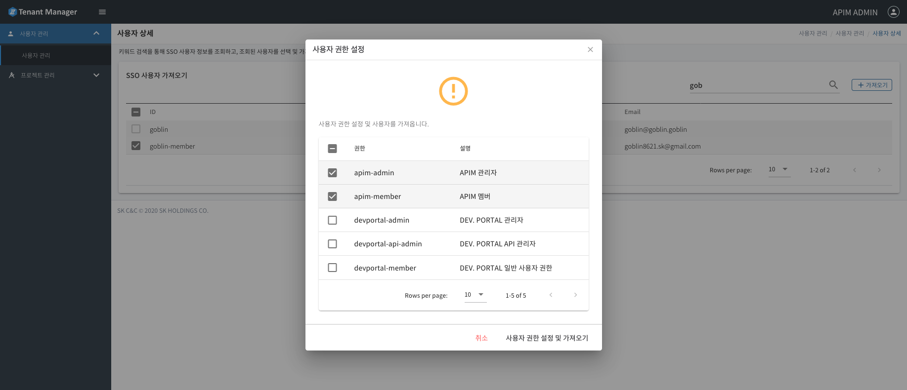
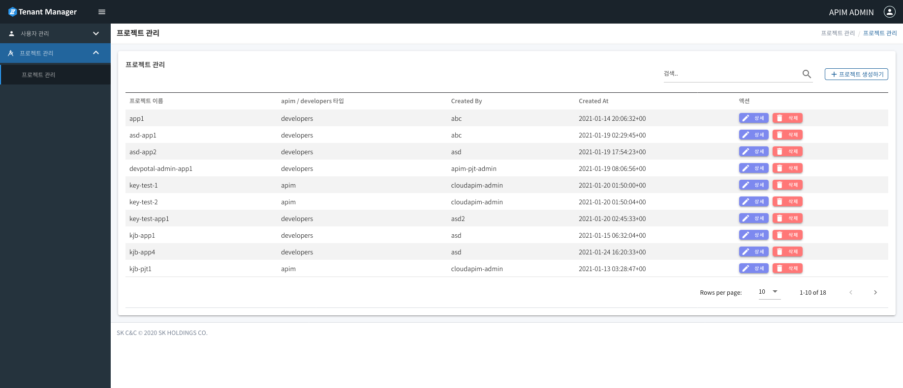
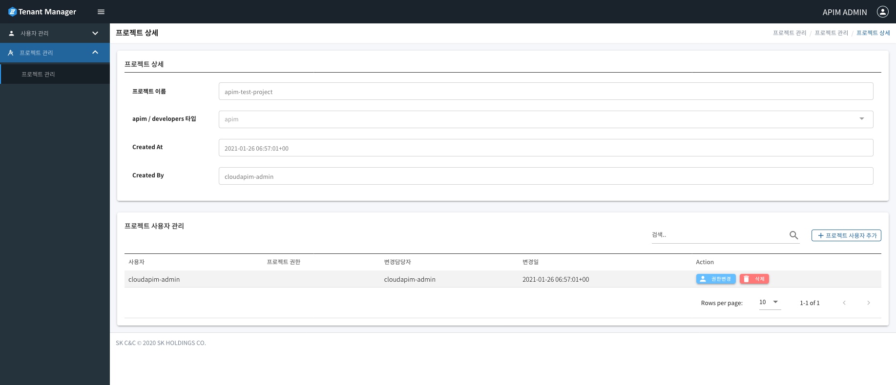

#  Tenant-Manager

- [권한 (Role)](#권한-(Role))
- [사용자 관리](#사용자-관리)
    - [SSO 사용자 조회 및 사용자 추가](#SSO-사용자-조회-및-사용자-추가)
    - [사용자 관리](#사용자-관리) 
    - [권한 수정](#권한-수정)
    - [사용자 삭제](#사용자-삭제)
- [프로젝트 관리](#프로젝트-관리)
    - [프로젝트 생성](#프로젝트-생성)
    - [프로젝트 사용자 관리](#프로젝트-사용자-관리)
    - [프로젝트 삭제](#프로젝트-삭제)

## 권한 (Role)

| 권한  | 설명  |
|---|---|
|사용자 권한|
| apim-admin | APIM 관리자 |
| apim-member | APIM 일반 사용자 권한 
 자신이 속한 프로젝트 내에서 Api 생성 배포만 가능한 일반 사용자 권한|
| devportal-admin | DEV. PORTAL 관리자 |
| devportal-api-admin | DEV. PORTAL API 관리자 
 DEV. PORTAL 에 게시된 특정 API의 관리 API 설명 작성, 티켓, 질문, 버그 등 담당하는 권한|
| devportal-member | DEV. PORTAL 일반 사용자 권한 
 DEV. PORTAL my app 생성 및 맴버 초대 가능|
|프로젝트 권한|
|apim-pjt-admin	| APIM 프로젝트 관리자|
|apim-pjt-member | APIM 프로젝트 멤버|
## 사용자 관리
### **SSO 사용자 조회 및 사용자 추가**
---
Apim은 ZCP SSO와 연동하여 사용자를 추가하며 사용자 권한을 따로 관리합니다. 
1. Tenant-Manager 메뉴에서 사용자 관리를 클릭합니다.

2. SSO 사용자 가져오기 버튼을 눌러 SSO 사용자를 조회한 후 추가할 사용자를 선택합니다.

3. 추가할 사용자를 선택하고 가져오기 버튼을 누르면 대항 사용자에 대한 권한을 선택합니다. 

4. 권한 선택 후 사용자 권한 설정 및 가져오기 버튼으로 사용자를 추가할 수 있습니다.

### **사용자 정보 수정**

---
1. 사용자 정보 관리를 위해 해당 사용자의 상세 버튼을 클릭합니다

2. 사용자의 정보를 수정 할 수 있습니다.

### **권한 수정**
---

1. 권한 수정을 위해 해당 사용자의 권한 변경 버튼을 클릭합니다.

2. 사용자의 권한을 수정 할 수 있습니다.

### **사용자 삭제**
---
1. 사용자 삭제를 위해 해당 사용자의 삭제 버튼을 클릭합니다

2. 사용자 정보 확인 후 삭제 버튼을 클릭하면 해당 사용자가 삭제됩니다.

## 프로젝트 관리
### **프로젝트 생성**
---

1. Tenant-Manager 메뉴에서 프로젝트 관리를 클릭합니다.

2. 각 항목을 입력합니다

    - 프로젝트 환경에 따라 Apim, Developer Portal 타입을 선택합니다.

### **프로젝트 사용자 관리**
---
1. 프로젝트 사용자 권한 관리를 위해 해당 프로젝트의 상세 버튼을 클릭합니다.

2. 프로젝트 사용자 관리 탭의 프로젝트 사용자 추가버튼을 클릭합니다.

3. 추가할 사용자를 조회하여 선택합니다.

4. 추가할 사용자의 권한을 선택 후 프로젝트 사용자 권한 설정 및 추가버튼을 클릭합니다.

5. 사용자가 추가되면 권한변경, 삭제가 가능합니다.

### **프로젝트 삭제**
---

1. 삭제할 프로젝트의 삭제 버튼을 클릭합니다.

2. 프로젝트 정보 확인 후 삭제 버튼을 클릭하면 해당 프로젝트가 삭제됩니다.
